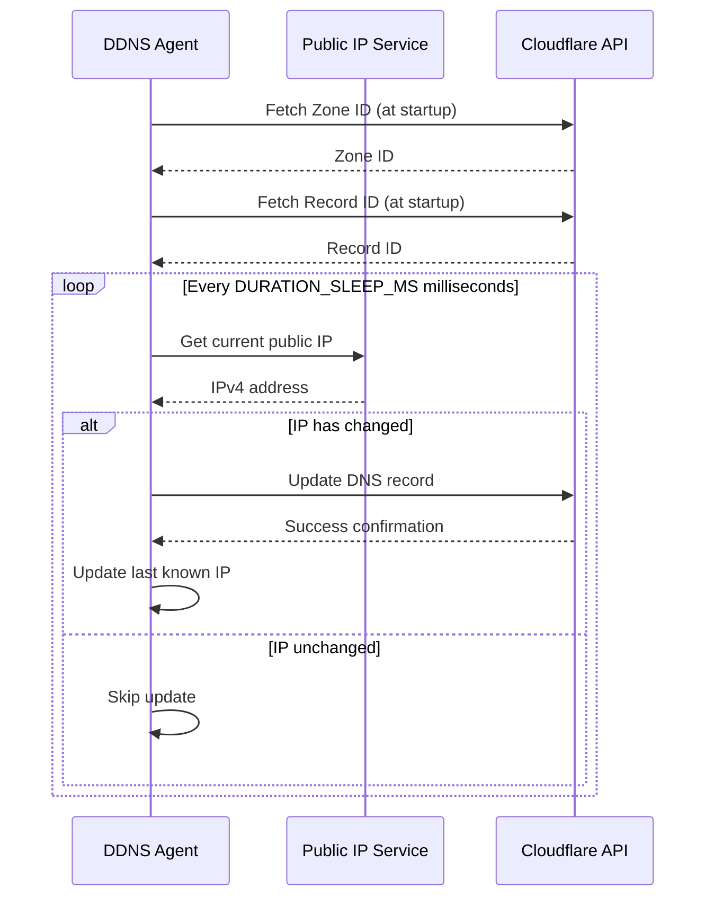

# DDNS Agent

<p align="center">
  <strong>A lightweight, efficient Rust service for automatic Dynamic DNS management with Cloudflare</strong>
</p>

<p align="center">
  <a href="#features">Features</a> •
  <a href="#quick-start">Quick Start</a> •
  <a href="#installation">Installation</a> •
  <a href="#configuration">Configuration</a> •
  <a href="#deployment">Deployment</a> •
  <a href="#troubleshooting">Troubleshooting</a>
</p>

---

## Overview

**DDNS Agent** is a high-performance Dynamic DNS (DDNS) agent written in Rust that automatically monitors your public IP address and updates Cloudflare DNS records when changes are detected. Designed for reliability and efficiency, it's perfect for maintaining consistent access to home servers, self-hosted services, and network infrastructure with dynamic IP addresses.

### Why DDNS Agent?

- **🏠 Home Server Access**: Keep your home server accessible with a consistent domain name
- **🔐 Self-Hosted Services**: Run personal VPN, media servers, or development environments
- **💰 Cost-Effective**: Avoid expensive static IP fees from ISPs
- **⚡ Lightweight**: Minimal resource footprint with Rust's efficiency
- **🔄 Automatic Discovery**: Zone ID and Record ID are fetched automatically—no manual API queries needed

---

## Features

- ✅ **Automatic IP Monitoring**: Continuously checks public IPv4 address at configurable intervals
- ✅ **Smart DNS Updates**: Only updates when IP changes, minimizing API calls
- ✅ **Automatic Configuration**: Fetches Cloudflare Zone ID and Record ID dynamically
- ✅ **Systemd Integration**: Native Linux service support for reliable operation
- ✅ **Simple Configuration**: Easy setup via environment variables
- ✅ **Robust Error Handling**: Graceful failure recovery with detailed logging
- ✅ **Minimal Dependencies**: Lean codebase with fast startup times

---

## Supported Platforms

| Platform | Status | Notes |
|----------|--------|-------|
| **Debian/Ubuntu** | ✅ Fully Supported | Systemd service included |
| **macOS** | ✅ Supported | Manual execution or launchd |
| **Other Linux** | ✅ Should work | Systemd required for service mode |

---

## Prerequisites

Before you begin, ensure you have:

1. **Cloudflare Account** with:
   - An active domain using Cloudflare nameservers
   - A DNS A record (subdomain) to update (e.g., `home.example.com`)
   - API token with DNS edit permissions

2. **System Requirements**:
   - Rust toolchain (1.70 or later)
   - Internet connectivity
   - (Linux) systemd for service deployment

---

## Quick Start

```bash
# Clone the repository
git clone <repository-url>
cd ddns-agent

# Copy and configure environment file
cp .env.example .env
nano .env  # Edit with your settings

# Build the project
cargo build --release

# Test run
./target/release/ddns_agent
```

---

## Installation

### 1. Install Rust

If you don't have Rust installed:

```bash
curl --proto '=https' --tlsv1.2 -sSf https://sh.rustup.rs | sh
. "$HOME/.cargo/env"
```

### 2. Install Build Dependencies (Debian/Ubuntu)

```bash
sudo apt update && sudo apt install -y build-essential pkg-config libssl-dev
```

### 3. Clone and Build

```bash
git clone <repository-url>
cd ddns-agent
cargo build --release
```

The compiled binary will be at `target/release/ddns_agent`.

---

## Configuration

### Step 1: Create Cloudflare DNS Record

1. Log into [Cloudflare Dashboard](https://dash.cloudflare.com)
2. Select your domain
3. Go to **DNS** → **Records**
4. Create an **A record**:
   - **Name**: Your subdomain (e.g., `home` for `home.example.com`)
   - **IPv4 address**: Your current public IP
   - **Proxy status**: DNS only (grey cloud)
   - **TTL**: Auto

### Step 2: Generate Cloudflare API Token

1. Navigate to [API Tokens](https://dash.cloudflare.com/profile/api-tokens)
2. Click **Create Token**
3. Use the **Edit zone DNS** template
4. Configure permissions:
   - **Permissions**: Zone → DNS → Edit
   - **Zone Resources**: Include → Specific zone → Select your domain
5. Click **Continue to summary** → **Create Token**
6. **Copy the token** (you won't see it again!)

### Step 3: Configure Environment Variables

```bash
cp .env.example .env
```

Edit `.env` with your settings:

```bash
# Required: Your Cloudflare API token
CF_API_TOKEN=your_cloudflare_api_token_here

# Required: The full DNS name to update (e.g., home.example.com)
DNS_NAME=your.domain.com

# Optional: Check interval in milliseconds (default: 5000)
DURATION_SLEEP_MS=5000
```

> **Note**: Zone ID and Record ID are **automatically fetched** at startup—no manual retrieval needed!

---

## Deployment

### Linux with Systemd

#### 1. Create Service File

```bash
cp ddns-agent.example.service ddns-agent.service
```

Edit `ddns-agent.service` and replace placeholders:

```ini
[Unit]
Description=DDNS Agent Dynamic DNS Agent
After=network.target

[Service]
Type=simple
WorkingDirectory=/opt/ddns-agent
ExecStart=/opt/ddns-agent/target/release/ddns_agent
EnvironmentFile=/opt/ddns-agent/.env
Restart=always
RestartSec=10
User=your_username

# Logging
StandardOutput=journal
StandardError=journal

[Install]
WantedBy=multi-user.target
```

**Replace**:
- `WorkingDirectory`: Path to your project directory
- `ExecStart`: Full path to the compiled binary
- `EnvironmentFile`: Path to your `.env` file
- `User`: Your Linux username

#### 2. Install and Start Service

```bash
# Copy service file
sudo cp ddns-agent.service /etc/systemd/system/

# Reload systemd
sudo systemctl daemon-reload

# Enable auto-start on boot
sudo systemctl enable ddns-agent.service

# Start the service
sudo systemctl start ddns-agent.service

# Check status
sudo systemctl status ddns-agent.service
```

#### 3. Monitor Logs

```bash
# Follow live logs
sudo journalctl -u ddns-agent.service -f

# View recent logs
sudo journalctl -u ddns-agent.service -n 50
```

### macOS

For macOS, you can either:

1. **Manual execution**: Run `./target/release/ddns_agent` in a terminal
2. **Background service**: Create a launchd plist file (similar to systemd)

Example launchd plist for `~/Library/LaunchAgents/com.user.ddns-agent.plist`:

```xml
<?xml version="1.0" encoding="UTF-8"?>
<!DOCTYPE plist PUBLIC "-//Apple//DTD PLIST 1.0//EN" "http://www.apple.com/DTDs/PropertyList-1.0.dtd">
<plist version="1.0">
<dict>
    <key>Label</key>
    <string>com.user.ddns-agent</string>
    <key>ProgramArguments</key>
    <array>
        <string>/path/to/ddns-agent/target/release/ddns_agent</string>
    </array>
    <key>WorkingDirectory</key>
    <string>/path/to/ddns-agent</string>
    <key>EnvironmentVariables</key>
    <dict>
        <!-- Load from .env file or set here -->
    </dict>
    <key>RunAtLoad</key>
    <true/>
    <key>KeepAlive</key>
    <true/>
</dict>
</plist>
```

Load with: `launchctl load ~/Library/LaunchAgents/com.user.ddns-agent.plist`

---

## How It Works



### Architecture

1. **Startup Phase**:
   - Load configuration from `.env`
   - Extract root domain from `DNS_NAME`
   - Query Cloudflare API to get Zone ID
   - Query Cloudflare API to get DNS Record ID

2. **Monitoring Loop**:
   - Check public IP via `public-ip` crate
   - Compare with last known IP
   - If changed, update Cloudflare DNS record
   - Sleep for configured duration
   - Repeat

---

## Troubleshooting

### Common Issues

#### Service Won't Start

**Check logs**:
```bash
sudo journalctl -u ddns-agent.service -n 50
```

**Common causes**:
- Invalid API token → Verify token has DNS edit permissions
- DNS record not found → Ensure A record exists in Cloudflare
- Missing `.env` file → Check `EnvironmentFile` path in service file

#### "Zone not found" Error

- **Cause**: The root domain isn't in your Cloudflare account
- **Solution**: Verify domain ownership and nameservers at Cloudflare dashboard

#### "DNS record not found" Error

- **Cause**: The A record for `DNS_NAME` doesn't exist
- **Solution**: Create the A record in Cloudflare DNS settings

#### IP Updates Aren't Happening

1. Check if IP is actually changing: `curl https://api.ipify.org`
2. Verify DNS record shows old IP in Cloudflare dashboard
3. Check service logs for errors
4. Ensure `DURATION_SLEEP_MS` isn't too long

#### Permission Denied Errors

- **Systemd service**: Ensure `User` in service file has read access to `.env` and execute permissions on binary
- **File paths**: Use absolute paths in service file

---

## Advanced Configuration

### Environment Variables

| Variable | Required | Default | Description |
|----------|----------|---------|-------------|
| `CF_API_TOKEN` | ✅ Yes | - | Cloudflare API token with DNS edit permissions |
| `DNS_NAME` | ✅ Yes | - | Full DNS name to update (e.g., `home.example.com`) |
| `DURATION_SLEEP_MS` | ❌ No | `5000` | Milliseconds between IP checks |

### Recommended Check Intervals

- **Typical home use**: 300-600 seconds (5-10 minutes)
- **Frequent changes**: 60-120 seconds (1-2 minutes)
- **Stable connection**: 900-1800 seconds (15-30 minutes)

> **Note**: Shorter intervals increase API usage but provide faster DNS updates after IP changes.

---

## Development

### Building from Source

```bash
# Debug build
cargo build

# Release build (optimized)
cargo build --release

# Run tests
cargo test

# Run with debug logging
RUST_LOG=debug cargo run
```

### Project Structure

```
ddns-agent/
├── src/
│   └── main.rs          # Main application logic
├── .env.example         # Example configuration
├── Cargo.toml           # Rust dependencies
├── ddns-agent.example.service  # Systemd service template
└── README.md            # This file
```

### Dependencies

- **tokio**: Async runtime
- **reqwest**: HTTP client for Cloudflare API
- **serde/serde_json**: JSON serialization
- **dotenvy**: Environment variable loading
- **anyhow**: Error handling
- **public-ip**: Public IP detection

---

## Contributing

Contributions are welcome! Please feel free to submit issues or pull requests.

## License

[Specify your license here]

## Security

- ⚠️ **Never commit `.env` files** to version control
- ⚠️ **Keep API tokens secure** and rotate them periodically
- ⚠️ **Use least-privilege tokens** (only DNS edit permissions for specific zones)

---

## Support

If you encounter issues:

1. Check the [Troubleshooting](#troubleshooting) section
2. Review service logs: `sudo journalctl -u ddns-agent.service`
3. Open an issue on the repository

---

<p align="center">Made with ❤️ using Rust</p>
